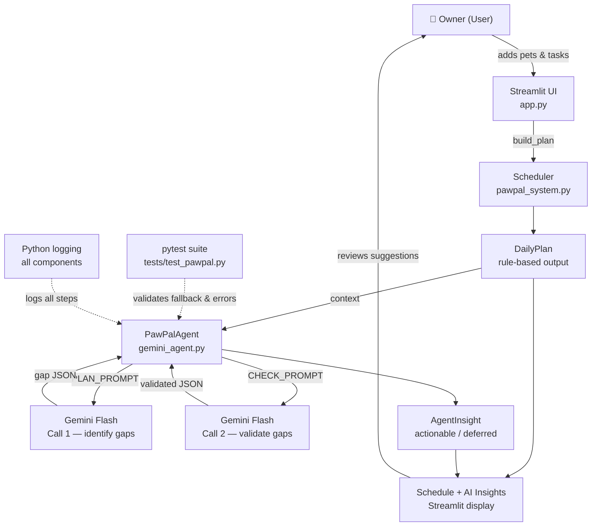

# PawPal+ System Architecture

Paste the Mermaid source below into https:x//mermaid.live, then export as PNG and save as `assets/architecture.png`.

```mermaid
flowchart TD
    User["👤 Owner (User)"]
    UI["Streamlit UI\napp.py"]
    Sched["Scheduler\npawpal_system.py"]
    Plan["DailyPlan\nrule-based output"]
    Agent["PawPalAgent\ngemini_agent.py"]
    G1["Gemini Flash\nCall 1 — identify gaps"]
    G2["Gemini Flash\nCall 2 — validate gaps"]
    Insight["AgentInsight\nactionable / deferred"]
    Display["Schedule + AI Insights\nStreamlit display"]
    Tests["pytest suite\ntests/test_pawpal.py"]
    Logger["Python logging\nall components"]

    User -->|adds pets & tasks| UI
    UI -->|build_plan| Sched
    Sched --> Plan
    Plan -->|context| Agent
    Agent -->|PLAN_PROMPT| G1
    G1 -->|gap JSON| Agent
    Agent -->|CHECK_PROMPT| G2
    G2 -->|validated JSON| Agent
    Agent --> Insight
    Plan --> Display
    Insight --> Display
    Display -->|reviews suggestions| User
    Tests -.->|validates fallback & errors| Agent
    Logger -.->|logs all steps| Agent
```
